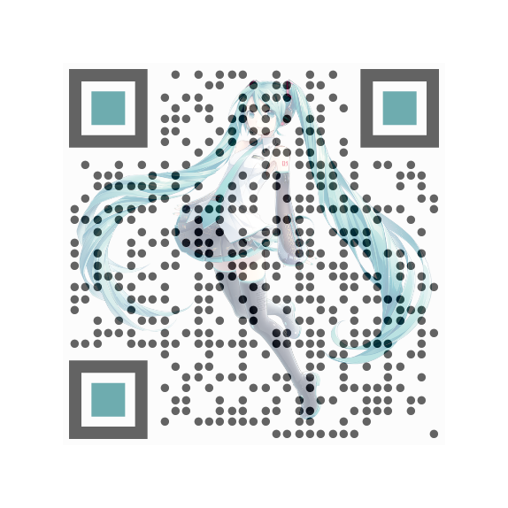

# qr-logo-js

A pure JS port of this project: https://github.com/gcoro/react-qrcode-logo

<div style="display: flex; flex-direction: row;">
	
	
	
  
  
</div>

## Usage

Include it in your html file:

```html
<script src="qr-logo-js.js"></script>
<script src="https://cdnjs.cloudflare.com/ajax/libs/qrcode-generator/1.4.4/qrcode.min.js"></script>
<script src="https://cdn.jsdelivr.net/npm/lodash@4.17.21/lodash.min.js"></script>
```

This script using lodash and qrcode-generator, so you need to include them too.

Then you can use it like this:

```html
<div id="qr-code"></div>
```

```javascript
const options = {
  value: "https://example.com/",
  size: 200,
  bgColor: "#FFFFFF",
  fgColor: "#000000",
  eyeRadius: [
    [10, 10, 0, 10], // top/left eye
    [10, 10, 10, 0], // top/right eye
    [10, 0, 10, 10], // bottom/left
  ],
  eyeColor: "#EC681B",
  qrStyle: "dots",
};
const qrCode = new QRCodeGenerator(options);
document.getElementById("qr-code").appendChild(qrCode.canvas);
```

## Props

| Prop                     | Type                                 | Default value          | Description                                                                                                                                    |
| ------------------------ | ------------------------------------ | ---------------------- | ---------------------------------------------------------------------------------------------------------------------------------------------- |
| `value`                  | `string`                             | `https://reactjs.org/` | The value encoded in the QR Code. When the QR Code is decoded, this value will be returned                                                     |
| `ecLevel`                | `L` &#124; `M` &#124; `Q` &#124; `H` | `M`                    | The error correction level of the QR Code                                                                                                      |
| `enableCORS`             | `boolean`                            | `false`                | Enable crossorigin attribute                                                                                                                   |
| `size`                   | `number` (in pixels)                 | `150`                  | The size of the QR Code                                                                                                                        |
| `quietZone`              | `number` (in pixels)                 | `10`                   | The size of the quiet zone around the QR Code. This will have the same color as QR Code bgColor                                                |
| `bgColor`                | `string` (css color)                 | `#FFFFFF`              | Background color                                                                                                                               |
| `fgColor`                | `string` (css color)                 | `#000000`              | Foreground color                                                                                                                               |
| `logoImage`              | `string` (src attribute)             |                        | The logo image. It can be a url/path or a base64 value                                                                                         |
| `logoWidth`              | `number` (in pixels)                 | `size * 0.2`           | Logo image width                                                                                                                               |
| `logoHeight`             | `number` (in pixels)                 | `logoWidth`            | Logo image height                                                                                                                              |
| `logoOpacity`            | `number` (css opacity 0 <= x <= 1)   | `1`                    | Logo opacity. This allows you to modify the transparency of your logo, so that it won't compromise the readability of the QR Code              |
| `logoOnLoad`             | `() => void`                         |                        | Callback function to know when the logo in the QR Code is loaded                                                                               |
| `removeQrCodeBehindLogo` | `boolean`                            | `false`                | Removes points behind the logo. If no logoPadding is specified, the removed part will have the same size as the logo                           |
| `logoPadding`            | `number`                             |                        | Adds a border with no points around the logo. When > 0, the padding will be visible even if the prop removeQrCodeBehindLogo is not set to true |
| `logoPaddingStyle`       | `square` &#124; `circle`             | `square`               | Sets the shape of the padding area around the logo                                                                                             |
| `qrStyle`                | `squares` &#124; `dots`              | `squares`              | Style of the QR Code modules                                                                                                                   |
| `eyeRadius`              | `CornerRadii` &#124; `CornerRadii[]` |                        | The corner radius for the positional patterns (the three "eyes" around the QR code). [See more details here](res/eyeRadius_doc.md)             |
| `eyeColor`               | `EyeColor` &#124; `EyeColor[]`       |                        | The color for the positional patterns (the three "eyes" around the QR code). [See more details here](res/eyeColor_doc.md)                      |
| `id`                     | `string`                             | `react-qrcode-logo`    | Optional custom id for the QRCode canvas. You can use this prop if you have multiple QRCodes and need to differentiate them                    |
